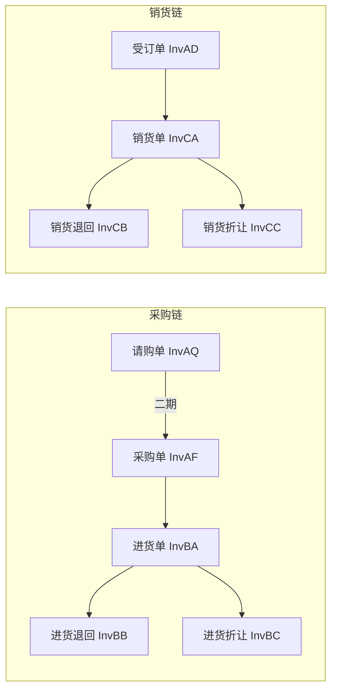

# 进销单据链 — 九单验收索引

> 您列出的 **销货三单 + 进货三单 + 采购单 + 请购单** 均已 **字段确认 + Vue 验收通过**（2026-05-23～24）。  
> 本文档供联调、培训、二期排期时一次查阅，**不替代**各菜单 `analysis/字段对照/*.md`。

## 一、菜单一览

| 链 | 菜单 | 代码 | 路由 | 表头/表身 | 对照表 | 功能说明 |
|----|------|------|------|-----------|--------|----------|
| 请购 | 请购单 | InvAQ | `/sq` | MF_SQ / TF_SQ | [请购单.md](./字段对照/请购单.md) | `erp-new/docs/11_请购单_功能说明.md` |
| 采购 | 采购单 | InvAF | `/po` | MF_POS / TF_POS (PO) | [采购单.md](./字段对照/采购单.md) | `erp-new/docs/12_采购单_功能说明.md` |
| 进货 | 进货单 | InvBA | `/pc` | MF_PSS / TF_PSS (PC) | [进货单.md](./字段对照/进货单.md) | `erp-new/docs/09_进货单_功能说明.md` |
| 进货 | 进货退回 | InvBB | `/pb` | MF_PSS / TF_PSS (PB) | [进货退回.md](./字段对照/进货退回.md) | `erp-new/docs/10_进货退回_功能说明.md` |
| 进货 | 进货折让 | InvBC | `/invbc` | MF_PSS / TF_PSS (PD) | [进货折让.md](./字段对照/进货折让.md) | `erp-new/docs/11_进货折让_功能说明.md` |
| 销售 | 销货单 | InvCA | `/sa` | MF_PSS / TF_PSS (SA) | [销货单.md](./字段对照/销货单.md) | `erp-new/docs/05_销货单_功能说明.md` |
| 销售 | 销货退回 | InvCB | `/sb` | MF_PSS / TF_PSS (SB) | [销货退回.md](./字段对照/销货退回.md) | `erp-new/docs/08_销货退回_功能说明.md` |
| 销售 | 销货折让 | InvCC | `/invcc` | MF_PSS / TF_PSS (SD) | [销货折让.md](./字段对照/销货折让.md) | `erp-new/docs/06_销货折让_功能说明.md` |

**前置（未列入本次九单，但销货链依赖）：** 受订单 InvAD `/so`（已开发，可单独验收）。

## 二、单据流转（SUNLIKE 原生逻辑）

## 三、首期已实现 vs 二期

| 流转 | 首期 | 说明 |
|------|------|------|
| 受订单 → 销货单 | ✅ | `/sa`「从销售订单转入」 |
| 销货单 → 退回/折让 | ✅ | `/sb`、`/invcc` 从销货单转入 |
| 采购单 → 进货单 | ✅ | `/pc`「从采购单转入」，回写 `tf_pos.qty_ps` |
| 进货单 → 退回/折让 | ✅ | `/pb`、`/invbc` |
| 请购单 → 采购单 | ✅ | 采购单 `/po`「从请购单转入」 |
| 请购单 → 采购单回写 | ✅ | 存盘累加 `TF_SQ.QTY_PO`；删改 PO 回滚 |

## 四、验收记录

| 批次 | 菜单 | 用户指令 | 日期 |
|------|------|----------|------|
| 销货 | 销货单、销货折让 | 字段确认 / 通过 | 2026-05-23 |
| 进货链 | 进货单、进货退回、进货折让 | 进货链 通过 | 2026-05-24 |
| 采购 | 采购单 | 通过 | 2026-05-24 |
| 请购+销退 | 请购单、销货退回 | 字段确认 → 通过 | 2026-05-24 |

## 五、联调入口（菜单）

- **销售**：销售订单、销货单、销货折让、销货退回  
- **进货**：请购单、采购单、进货单、进货退回、进货折让  

启动：`erp-new/server` + `erp-new/client-vue`（见 `Project_Status.md`）。
